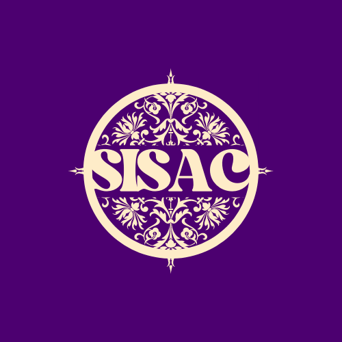

# SISAC-Student Information System And Cafeteria

SISAC is an application software which is supported in android and iOS platforms.

This application software is an improvisation to the traditional - transaction processing systems
SISAC would be a new way of record management and transaction processing that would
achieve efficiency on processing institute information. It uses technologies like Flutter,
JavaScript, NodeJS to implement the modification, retrieving,processing and displaying various types of information according to the requirement of the
student/faculty.

This system will make the data/information like Class Time Tables,
Assignments, Attendance Tracking, Subject Information, Faculty Information, Events,
Canteen related facilities to the students and will also provide an interface to access, modify
the Assignments, Attendance etc. for the faculty.

SISAC will considerably decrease the time spent on paperwork, forwarding, and
communication gap and will efficiently increase the management of facilities, time and
activities of the student. It will bring about the ALL IN ONE application which a university
will need.

## Tech Stack

**Client:** Flutter 2.0

**Server:** NodeJs, ExpressJs, MongoDB, Mongoose

**API Testing:** Postman

## Supported OS

1.Android

2.iOS

## Authors

### KARS

-   Arham S C 1by20cs152@bmsit.in
-   Rayees Hussain 1by20cs48@bmsit.in
-   Subramanya Keshav 1by20cs192@bmsit.in
-   S Sagar 1by20cs156@bmsit.in
